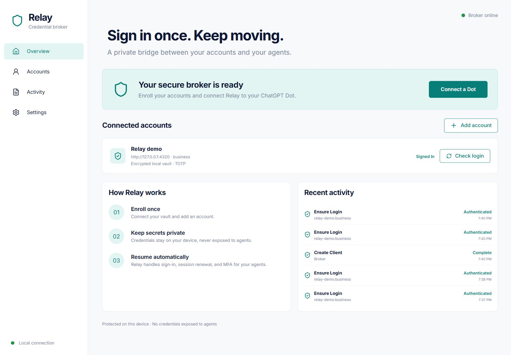

# Relay

A private desktop credential broker for ChatGPT Dots and other MCP clients. Save one shared website password and default email once. FraudBot navigates each website, focuses its login field, and calls Relay's fill tool. A paired Chrome companion fills the field directly; the AI receives `FILLED` or `BLOCKED`, never the password. No company-specific adapter or enrollment is required for this workflow.



The Chrome companion supports visible native HTML inputs in the paired desktop Chrome profile. The shared password must already be valid for an existing account, or satisfy the site's rules for a new one. AI navigation and site/ChatGPT confirmations remain the host's responsibility. The optional isolated browser workflow still supports explicitly configured sign-in, MFA, session renewal and page reading.

## Run on Windows

Install Node.js 22 or newer (24 recommended), then from this repository:

```powershell
npm ci
npm run browser:install
npm run build
npm start
```

In a second terminal:

```powershell
npm run console
```

The console runs at `http://127.0.0.1:4318`. `npm run console` opens an authenticated link with a short-lived URL fragment; the console removes the fragment on load. The access token itself remains valid until the encrypted store is replaced; keep the console browser private. The initial store uses Windows CurrentUser DPAPI. Start setup can rewrap its random AES key using a non-exportable Windows TPM RSA key. TPM failure is an error, never a silent software fallback.

Click **Start setup**, choose TPM or DPAPI, then **Try the local demo**. The demo is an explicitly local fixture with published test credentials, not a real connected supplier.

For frontend development use `npm run dev`, and open `npm run console -- --dev`.

## Run on your own Mac

Use macOS 14+, Node.js 22+ and ordinary Chrome. From the source repository:

```sh
npm run setup:mac
npm run start:mac
```

The Mac launcher prompts privately for the portable vault unlock passphrase and opens the local console. Create a fresh Mac vault, pair Chrome and configure a separate private Dot connection. See [the Mac setup guide](docs/MAC.md) for the full sequence and verification limits. Windows TPM/DPAPI vaults are not transferable. The managed Dot cloud browser still lacks a supported companion-install path.

## Use with ChatGPT Dots

See [the Dot connection guide](docs/CHATGPT-DOTS.md). Relay includes:

- MCP stdio and stateless Streamable HTTP transports.
- A client grant restricted to selected accounts and operations, revocable immediately.
- A preparation script and managed runtime runner for OpenAI Secure MCP Tunnel so the broker can remain private.
- A portable skills plugin in `plugin/`, usable alongside the connected Relay MCP plugin.

For shared autofill the path is **Dot → Relay MCP tool → local broker → paired Chrome companion → focused login field**. FraudBot uses its regular browser session, without any cookie transfer. See [Chrome companion setup](docs/BROWSER-COMPANION.md). Save the shared credential under Settings, pair Chrome once, and enable shared browser autofill for the existing Dot under **Settings → Connected clients → Manage access**. Signup requires both the shared credential's new-account setting and the Dot's signup permission.

| Tool                  | Result                                                                                             |
| --------------------- | -------------------------------------------------------------------------------------------------- |
| `list_accounts`       | Scoped account identifiers and permitted task pages                                                |
| `ensure_login`        | `AUTHENTICATED`, `BLOCKED`, or `ERROR`                                                             |
| `read_account_page`   | Visible text from an exact owner-enrolled task URL                                                 |
| `create_account`      | Configured signup, verification and optional TOTP enrollment; requires a separate signup grant     |
| `fill_saved_username` | Fill the default email in the matching focused native-browser field; no email in the tool response |
| `fill_saved_password` | Fill the one saved password at the exact requested HTTPS origin; returns only a status             |
| `fill_saved_totp`     | Fill an enrolled account's authenticator code directly; requires its saved TOTP seed               |

No secret retrieval, arbitrary JavaScript, cookie export, mailbox search, shell, or unrestricted browser tools are exposed. The MCP annotations accurately flag authentication workflows as potentially mutating, including configured password reset. ChatGPT and Dot permissions remain in effect.

## One shared credential

In **Settings → Shared website credential**, enter your default email and shared password locally, or choose **Generate my shared password once**. Relay stores one credential in the existing encrypted vault. It never reads back the password into the console. Enable new-account fields only if you want the same saved password used for signup. The fill tool does not click Submit, accept terms, or create accounts by itself.

The AI calls `fill_saved_password({"origin":"https://current-site.example"})` after focusing the password input. Omit `site` to use the shared credential. The companion verifies the live origin, field type, focus nonce and form destination. It refuses changed focus and password-change forms. Multiple matching tabs require an explicit `tabId`.

## Optional configured broker workflows

In Accounts, enter credentials locally or choose a Bitwarden Secrets Manager secret ID. Configure exact origins, sign-in selectors, a signed-in marker, and the session-check URL. Set exact task URLs the Dot may read. Add any required identity-provider and asset origins explicitly; other network requests are blocked.

Bitwarden uses the official Node SDK with a machine-account token. In Settings, connect a token limited to your automation project. Each selected secret's value is this JSON object:

```json
{
  "username": "automation@yourdomain.com",
  "password": "your-existing-website-password",
  "totpSecret": "YOUR_EXISTING_BASE32_SEED",
  "recoveryCodes": []
}
```

Omit `totpSecret` when not used. Password rotation and recovery-code reservation update the same Bitwarden secret in memory through the SDK, with no secret argv or plaintext SDK cache. The machine account needs write permission for those operations. An expired or revoked token produces a safe error; Relay cannot manufacture replacement vault authority.

For email MFA, verification or password reset, connect a dedicated existing TLS IMAP mailbox. Use the receiving server's trusted `Authentication-Results` authserv-id. Relay matches exact sender, recipient, subject, recent internal arrival time, aligned DKIM, and permitted HTTPS link origins. The provider must strip forged inbound copies of its own authserv-id. Codes/links are reserved before use. See [adapter configuration](docs/ADAPTERS.md).

Signup uses a preconfigured alias template such as `automation+{alias}@yourdomain.com`; your mailbox provider must already deliver those aliases. Relay generates a 32-character random password and records the candidate before signup. An uncertain signup is not blindly retried. Recovery codes are consumed only by an explicitly selected recovery adapter. TOTP and email MFA are selected per adapter; Relay does not guess or silently downgrade authentication.

## Startup after reboot

The optional native .NET Windows service host is in `windows/Relay.Service`. Install it from elevated PowerShell under the SAME Windows account used for enrollment:

```powershell
.\scripts\install-service.ps1
# Stop a manually running instance, then:
Start-Service RelayCredentialBroker
```

The installer prompts locally for that Windows account's service credential. Windows SCM stores it, not source files. The account must have **Log on as a service** rights. A Windows Hello PIN is not a service password. You need the .NET 8 SDK to publish the service; the resulting host is self-contained. It starts the broker at boot and restarts after failure. It has been compiled locally; live service installation and reboot behavior need verification on the target service account.

To supervise an already configured official tunnel-client too, save an existing tunnel runtime credential with `scripts/save-tunnel-credential.ps1`, then pass `-TunnelPath` and optionally `-TunnelProfile` and `-TunnelProfileDir` to the installer. The profile directory defaults to `data/tunnel-profiles`. The runtime credential uses CurrentUser DPAPI, independently of the TPM-wrapped vault key. The service decrypts it only into the child environment. Do not change the service identity without re-enrollment or key migration. Windows login, disk-unlock policy, token revocation, hardware failure, and provider security checks can still affect availability.

## Verification

```powershell
npm run check
npm audit --audit-level=high
dotnet build windows/Relay.Service/Relay.Service.csproj -c Release
```

Tests cover AES-GCM tampering, RFC 6238 vectors, real Chromium login, TOTP, encrypted persistence and session restoration, session invalidation, concurrent sign-in deduplication, pending password recovery, exact URL restrictions, human-verification blocks, DKIM filtering, console/client separation, MCP initialization, revocation and origin/Host checks. GitHub Actions runs these checks on Windows and macOS, with an additional Mac launcher startup/reopen check.

Current limits and threat model: [SECURITY.md](docs/SECURITY.md). Functional and visual checks: [VERIFICATION.md](docs/VERIFICATION.md).

## Configuration

| Variable                       | Default / purpose                                                                                           |
| ------------------------------ | ----------------------------------------------------------------------------------------------------------- |
| `RELAY_DATA_DIR`               | `data/`; restricted, encrypted, excluded from Git                                                           |
| `RELAY_HEADLESS`               | `true`; set `false` for local adapter debugging                                                             |
| `RELAY_BITWARDEN_API_URL`      | `https://api.bitwarden.com`; use a trusted regional server when needed                                      |
| `RELAY_BITWARDEN_IDENTITY_URL` | `https://identity.bitwarden.com`                                                                            |
| `RELAY_KEY_MODE`               | Windows DPAPI; `passphrase` is explicit portable/test mode                                                  |
| `RELAY_PASSPHRASE`             | Required for portable mode, at least 20 characters; cannot auto-unlock without secure external provisioning |
| `RELAY_CLIENT_TOKEN`           | Optional scoped bridge token; normally read by `--client-id` from the protected store                       |

Back up both `data/master-key.json` and `data/vault.enc` together. TPM/DPAPI protection is bound to the machine/account; copying files to another PC is not a recovery strategy. No plaintext fallback is implemented.
